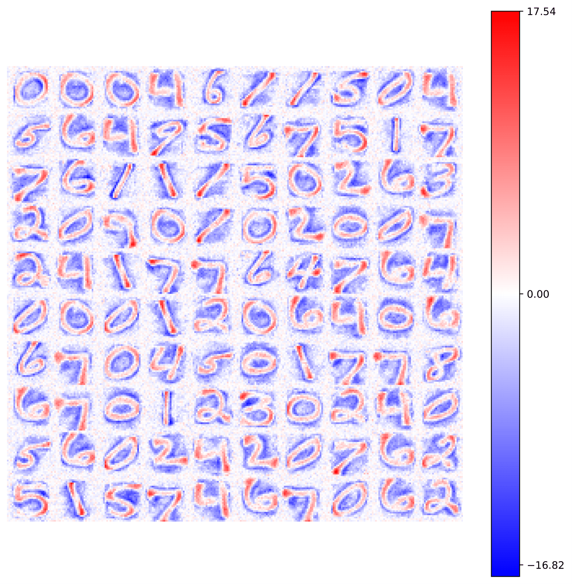

# Biolearn
### Unsupervised neural networks with biological-inspired learning rules

[](https://biolearn.readthedocs.io/en/latest/?badge=latest)

  - [Prerequisites](#prerequisites)
  - [Installation](#installation)
  - [Usage](#usage)
  - [Authors](#authors)


## Prerequisites
The only requirements to successfully install, test, and use the `biolearn` package are the following:

* numpy
* matplotlib
* scikit-learn
* tqdm
* pytest
* hypothesis

This `Python` version guarantees a good integration with the other common Machine Learning tools provided by `scikit-learn` package.
In this way you can use the `biolearn` algorithm as an equivalent alternative in other pipelines.
Like other Machine Learning algorithms also the `biolearn` ones depend on many hyper-parameters, which have to be tuned according to the given problem.


## Installation
To install the `biolearn` package, first you have to clone the repository:

```bash
git clone https://github.com/SimoneGasperini/biolearn.git
```

Then, install the prerequisites using `pip`:

```bash
cd biolearn
pip install -r requirements.txt
```

Finally, simply run the `setup.py` script to complete the installation:

```bash
python setup.py install
```

## Usage
The `biolearn` classes provide the member function `fit` to train your model on data.
Here, a simple example on MNIST digits dataset is shown.

```python
from sklearn.datasets import fetch_openml

# Download and normalize MNIST dataset
X, y = fetch_openml(name='mnist_784', version=1, data_id=None, return_X_y=True)
X *= 1. / 255


from biolearn.model.bcm import BCM
from biolearn.utils.activations import Relu
from biolearn.utils.optimizer import Adam

# Build and fit the model
model = BCM(outputs=100, num_epochs=20, batch_size=1000, activation=Relu(), optimizer=Adam())
model.fit(X)
```

You can also visualize the synaptic weights using the utility function provided by the package:

```python
from biolearn.utils.misc import view_weights

view_weights(model.weights, dims=(28, 28))
```


More complete examples are provided as `Jupyter` notebooks in the [examples](https://github.com/SimoneGasperini/biolearn/tree/main/examples) directory. For both a basic theoretical description of the models and an exhaustive explanation about how to use the code see the [documentation](https://biolearn.readthedocs.io/en/latest/#).


## Authors
*  **Nico Curti** [git](https://github.com/Nico-Curti), [unibo](https://www.unibo.it/sitoweb/nico.curti2)

*  **Simone Gasperini** [git](https://github.com/SimoneGasperini)

*  **Mattia Ceccarelli** [git](https://github.com/Mat092), [unibo](https://www.unibo.it/sitoweb/mattia.ceccarelli5/)

See also the original complete repository [plasticity](https://github.com/Nico-Curti/plasticity.git) (by Nico Curti), which provides a `Cython` wrap and the `C++` implementation of the same models.